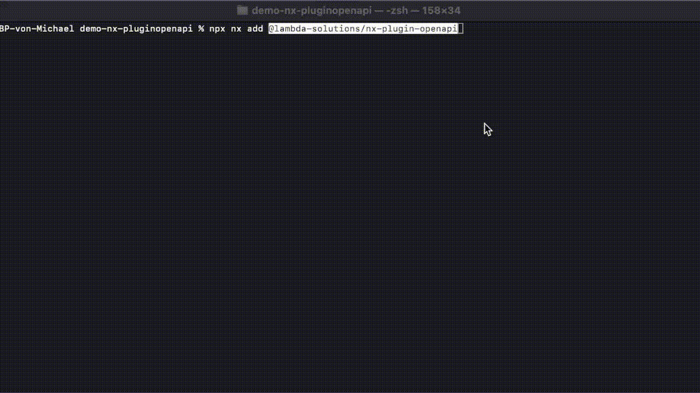

# @lambda-solutions/nx-plugin-openapi
Nx Plugin for seamless Nx integration of [OpenApi Generator](https://openapi-generator.tech) Angular client.

## Features
* Executor for generating Angular API clients from OpenAPI specifications



## Installation

To install the Plugin in your Nx workspace, run the following command:
```bash
nx add @lambda-solutions/nx-plugin-openapi
```

Or if you prefer to install it manually, you can add it as a dev dependency:
```bash
npm install --save-dev @lambda-solutions/nx-plugin-openapi
```
### Options for `nx add`
You can also specify options when running `nx add` by appending them via `--{optionName}=value`.

Following options are available:
- `--skipFormat`: If set to `true`, the plugin will not format the workspace after installation. Default is `false`.


## Prerequisites

This plugin requires the OpenAPI Generator CLI as a peer dependency:

```bash
npm install --save-dev @openapitools/openapi-generator-cli
```

## Usage `generate-api` Executor

### Integrate the executor in your Nx task pipeline
In your `nx.json` it makes sense to update the `targetDefaults` to include the `generate-api` executor for all relevant projects:

```json
{
  "targetDefaults": {
    "generate-api": {
      "executor": "@lambda-solutions/nx-plugin-openapi:generate-api",
      "cache": true,
      "inputs": ["{projectRoot}/swagger.json", "{projectRoot}/openapitools.json", "{projectRoot}/api-config.json"]
    }
  },
  "build": {
    "dependsOn": ["^build","^generate-api", "generate-api"]
  }
}
```

### Configure the `generate-api` executor in your project

Add the executor to your project's `project.json`:

```json
{
  "targets": {
    "generate-api": {
      "executor": "@lambda-solutions/nx-plugin-openapi:generate-api",
      "options": {
        "inputSpec": "apps/my-app/swagger.json",
        "outputPath": "libs/api-client/src"
      },
      "outputs": ["{options.outputPath}"]
    }
  }
}
```

### Run the executor

```bash
nx run my-app:generate-api
```

## Options

| Option | Type | Required | Default | Description |
|--------|------|----------|---------|-------------|
| `inputSpec` | string | Yes | - | Path to the OpenAPI specification file (local file or URL) |
| `outputPath` | string | Yes | - | Output directory for the generated client |
| `configFile` | string | No | - | Path to OpenAPI Generator configuration file |
| `skipValidateSpec` | boolean | No | `false` | Skip OpenAPI spec validation |

> [!TIP]
> Right now we only support the `typescript-angular` generator type.

## Examples

### Basic usage with local OpenAPI spec

```json
{
  "generate-api": {
    "executor": "@lambda-solutions/nx-plugin-openapi:generate-api",
    "options": {
      "inputSpec": "apps/demo/swagger.json",
      "outputPath": "libs/api-client/src"
    }
  }
}
```

### Using a remote OpenAPI spec
> [!HINT]
> Nx caching also works when using a remote OpenAPI spec. The executor will cache the generated files based on the content of the OpenAPI spec.
> This means that if the OpenAPI spec changes, the executor will regenerate the files.
> If the OpenAPI spec does not change, the executor will use the cached files.
> 
> A drawback of this approach is that we always need to fetch the remote OpenAPI spec on each executor run.


```json
{
  "generate-api": {
    "executor": "@lambda-solutions/nx-plugin-openapi:generate-api",
    "options": {
      "inputSpec": "https://api.example.com/swagger.json",
      "outputPath": "libs/api-client/src"
    }
  }
}
```

### With custom configuration file

```json
{
  "generate-api": {
    "executor": "@lambda-solutions/nx-plugin-openapi:generate-api",
    "options": {
      "inputSpec": "apps/demo/openapi.json",
      "outputPath": "libs/api-client/src",
      "configFile": "apps/demo/api-config.json"
    }
  }
}
```

### Skip validation for faster generation

```json
{
  "generate-api": {
    "executor": "@lambda-solutions/nx-plugin-openapi:generate-api",
    "options": {
      "inputSpec": "apps/demo/swagger.json",
      "outputPath": "libs/api-client/src",
      "skipValidateSpec": true
    }
  }
}
```

### Configuration File

You can use an OpenAPI Generator configuration file to customize the generation process. Create an `api-config.json` file:

```json
{
  "npmName": "@my-org/api-client",
  "npmVersion": "1.0.0",
  "ngVersion": "17.0.0",
  "providedInRoot": true,
  "withInterfaces": true,
  "useSingleRequestParameter": true
}
```

Then reference it in your executor options:

```json
{
  "configFile": "apps/demo/api-config.json"
}
```

## Notes

- The executor automatically cleans the output directory before generating new files
- The generated Angular client will be compatible with your current Angular version

## Roadmap
- Support for all generator options available in OpenAPI Generator: https://openapi-generator.tech/docs/generators/typescript-angular/
- Caching support when OpenApi-File is consumend from a remote URL


## License

MIT
